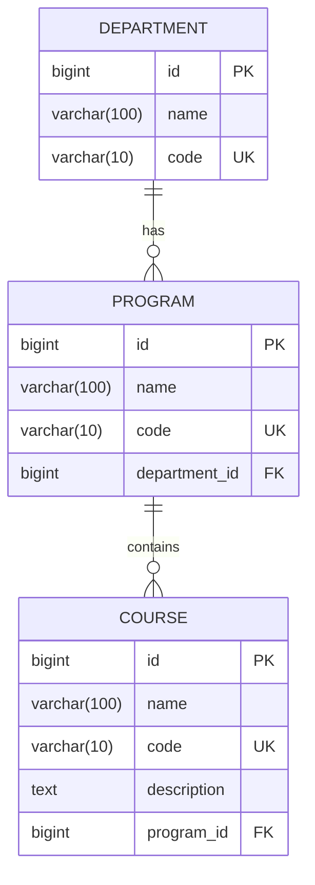

# v0.2 — Academic Core

**Status:** Complete
**Date:** 2026-08-30

## Objective

Introduce the first real CampusCore domain: `Department`, `Program`, and `Course` with proper relationships, constraints, and API endpoints.

## Features Implemented

- `Program` model with foreign key to `Department` (`on_delete=PROTECT`)
- `Course` model with foreign key to `Program` (`on_delete=PROTECT`)
- Unique `code` fields on all models
- Django admin registration for `Program` and `Course`
- DRF endpoints:
  - `/api/departments/` (already from v0.1)
  - `/api/programs/` (list/create)
  - `/api/courses/` (list/create)
- Read-only nested fields (`department_name`, `program_name`) in serializers
- Tests for model relationships, constraints, and API endpoints
- Database inspection of foreign key constraints and indexes

## Entity Relationship Diagram (ERD)



## Key Learning Points

- `ForeignKey` relationships and `on_delete` behavior (`PROTECT` to maintain referential integrity)
- `related_name` for reverse access (e.g., `department.programs.all()`)
- Automatic index creation on foreign key columns by Django
- Unique constraints and how they are enforced at the database level
- DRF `ModelSerializer` with read-only source fields for nested display
- Testing relationship creation, reverse access, and deletion protection

## How to Test

```bash
python manage.py test
```

All 12 tests pass.

## Next Steps

Proceed to **v0.3 — Users, Authentication & Roles**: introduce custom user model, login/logout, role-based dashboards, and permissions.