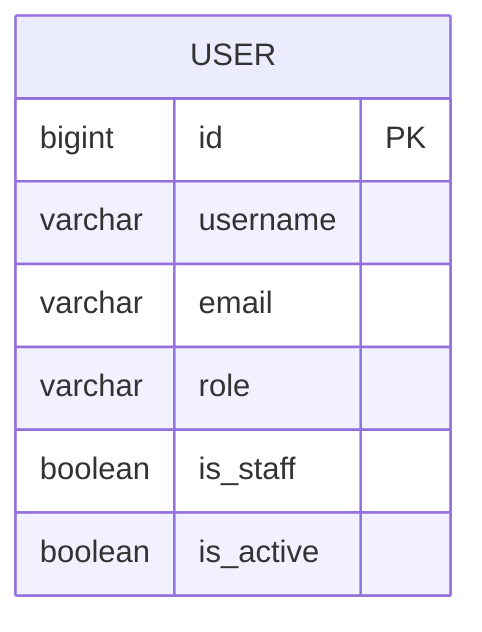

# v0.3 — Users, Authentication & Roles

**Status:** Complete
**Date:** 2026-08-30

## Objective

Introduce real users with authentication and role-based access control using a custom user model.

## Features Implemented

- Custom user model `accounts.User` extending `AbstractUser` with a `role` field
  - Roles: Admin, Teacher, Student (default: Student)
- `AUTH_USER_MODEL` set to `'accounts.User'`
- Database reset to accommodate custom user model
- Django admin registration for user model
- Login and logout views (using Django's built-in `LoginView` and `LogoutView`)
- Role-based dashboards:
  - `/accounts/admin-dashboard/`
  - `/accounts/teacher-dashboard/`
  - `/accounts/student-dashboard/`
- Custom `@role_required` decorator to enforce role-based access
  - Authenticated users with wrong role get 403
  - Anonymous users are redirected to login
- Existing academic web view (`/departments/`) now requires login
- DRF APIs protected:
  - Department/Program/Course: authenticated read, admin write (`IsAdminOrReadOnly` custom permission)
  - User API: admin-only (`IsAdminRole` custom permission)
- Custom permission classes return 403 for unauthorized (unauthenticated or wrong role)
- Tests for models, views, and APIs (27 total)

## Entity Relationship Diagram (ERD)



*Note: `accounts.User` has no foreign-key relationship to `Department`, `Program`, or `Course` in this version — it's introduced as a standalone entity. See the v0.2 doc for the academic-core schema.*

## Key Learning Points

- Extending Django's `AbstractUser` to create a custom user model
- Setting `AUTH_USER_MODEL` before initial migrations
- Database reset process when changing core models
- Django authentication views and redirect settings (`LOGIN_URL`, `LOGIN_REDIRECT_URL`, `LOGOUT_REDIRECT_URL`)
- Secure logout using POST (CSRF protection) and updating templates accordingly
- Implementing custom `role_required` decorator for role-based access control
- Difference between authentication (logged in?) and authorization (has role/permission?)
- DRF authentication and permission classes:
  - `IsAdminOrReadOnly`: read for authenticated, write only for admin
  - `IsAdminRole`: admin-only access
- Returning 403 for unauthorized requests (common DRF behavior) vs 401 for unauthenticated
- Writing tests for authentication flows, role-based access, and API permissions

## How to Run

```bash
source venv/bin/activate
python manage.py migrate
python manage.py runserver
```

- Admin: create a superuser via `python manage.py createsuperuser`
- Set role to ADMIN via shell: `python manage.py shell -c "from accounts.models import User; u=User.objects.get(username='admin'); u.role='ADMIN'; u.save()"`
- Login at `/accounts/login/`
- Access role dashboards via `/accounts/`

## Testing

Tests are organized in packages:

- `accounts/tests/test_models.py`
- `accounts/tests/test_views.py`
- `accounts/tests/test_api.py`
- `academics/tests/test_models.py`
- `academics/tests/test_api.py`

Run all tests:

```bash
python manage.py test
```

## Next Steps

Proceed to **v0.4 — Sections & Enrollment**: introduce transactional workflow with many-to-many relationships and business rules.