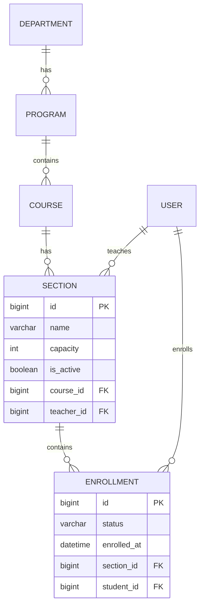

# v0.4 — Sections & Enrollment

**Status:** Complete
**Date:** 2026-08-30

## Objective

Introduce the first important transactional workflow: sections for courses, teacher assignment, and student enrollment with business rules and data integrity.

## Features Implemented

- `Section` model:
  - Foreign key to `Course`
  - Foreign key to `User` with role `TEACHER` (via `limit_choices_to`)
  - `name`, `capacity` (optional, non-negative), `is_active`
  - Unique constraint: `(course, name)`
- `Enrollment` model:
  - Foreign key to `Section`
  - Foreign key to `User` with role `STUDENT`
  - `status` (Active, Dropped, Completed), default Active
  - `enrolled_at` timestamp
  - Unique constraint: `(section, student)` prevents duplicate enrollment
- Admin registration for both models
- Custom user admin (`accounts/admin.py`) to expose `role` field in forms
- DRF endpoints:
  - `/api/sections/` (list/create) — permission: admin or teacher can create, any authenticated user can list
  - `/api/enrollments/` (list/create) — permission: admin or teacher can create; students can list only their own enrollments
- Business rules enforced:
  - Only users with role `TEACHER` can be assigned as section teacher
  - Only users with role `STUDENT` can be enrolled
  - Duplicate enrollment blocked (both DB unique constraint and application validation)
  - Capacity check if section capacity is set (transactional with `select_for_update`)
- Tests: 41 total, covering model relationships, constraints, API permissions, capacity, duplicates, and student filtering.

## Entity Relationship Diagram (ERD)



## Key Learning Points

- Using `limit_choices_to` in model ForeignKey for admin dropdown filtering (not database enforcement)
- Composite unique constraints with `unique_together`
- `PositiveIntegerField` creates a database CHECK constraint (`capacity >= 0`)
- Custom DRF permission `IsAdminOrTeacher`
- Overriding `get_queryset` in DRF to filter results based on user role (students see own enrollments)
- Using `transaction.atomic()` and `select_for_update()` to prevent race conditions when checking capacity and duplicates
- Customizing Django admin to include additional fields (`role`) for user creation/editing
- Understanding difference between application-level RBAC and database-level RBAC

## How to Run

```bash
source venv/bin/activate
python manage.py runserver
```

- Admin panel: create courses, sections, enrollments
- API endpoints: `/api/sections/`, `/api/enrollments/`

## Testing

```bash
python manage.py test
```

All 41 tests pass.

## Next Steps

Proceed to **v0.5 — Attendance**: build attendance sessions and records, with bulk updates, aggregations, and student-facing summaries.