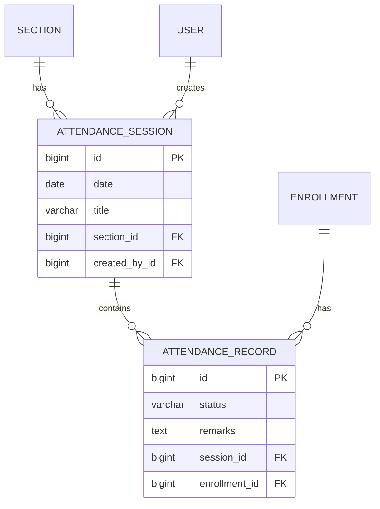

# v0.5 — Attendance

**Status:** Complete
**Date:** 2026-08-30

## Objective

Build an academic workflow around attendance: teachers can create attendance sessions and mark students, and students can view their own attendance summary.

## Features Implemented

- `AttendanceSession` model:
  - Foreign key to `Section`
  - `date`, optional `title`, `created_by` (teacher)
  - No unique constraint on `(section, date)` – allows multiple sessions per day
- `AttendanceRecord` model:
  - Foreign key to `AttendanceSession`
  - Foreign key to `Enrollment` (ensures student is enrolled in the session's section)
  - `status` choices: Present, Absent, Late, Excused
  - `remarks` optional
  - Unique constraint on `(session, enrollment)` prevents duplicate records
- Admin registration for both models
- DRF endpoints:
  - `/api/attendance-sessions/` – list/create (admin/teacher)
    - Teachers can only create sessions for their own sections
    - Teachers see only sessions for sections they teach
  - `/api/attendance-records/` – list/create (admin/teacher)
    - Supports bulk creation (send JSON array)
    - Atomic transaction for bulk create
    - Validates enrollment belongs to session's section
  - `/api/attendance-summary/` – any authenticated user
    - Students see own summary (per section: total sessions, present count, percentage)
    - Admin/teacher must provide `student_id` query param to see a student's summary
- Permissions:
  - `IsAdminOrTeacher` for session and record creation
  - `IsAuthenticated` for summary (custom logic filters by role)
- Tests: 58 total, covering models, API, permissions, bulk creation, duplicate prevention, and summary calculations.

## Entity Relationship Diagram (ERD)



## Key Learning Points

- Modeling attendance via `Enrollment` to maintain data integrity
- Allowing multiple sessions per day (no unique constraint on section+date)
- Bulk creation with DRF: detecting list input and using `many=True`
- Using `transaction.atomic()` for bulk operations to ensure all-or-nothing
- `select_for_update()` for locking in enrollment, but not needed in attendance because we rely on unique constraint
- Custom permission logic: teachers restricted to their own sections; students restricted to own data
- Aggregating attendance percentages using `Count` and conditional filters
- API summary endpoint with query parameters for admin/teacher vs student

## How to Run

```bash
source venv/bin/activate
python manage.py runserver
```

- Admin panel: create attendance sessions and records
- API endpoints: `/api/attendance-sessions/`, `/api/attendance-records/`, `/api/attendance-summary/`

## Testing

```bash
python manage.py test
```

All 58 tests pass.

## Next Steps

Proceed to **v0.6 — Assessments & Grades**: introduce assessments and grade recording with constraints and aggregations.