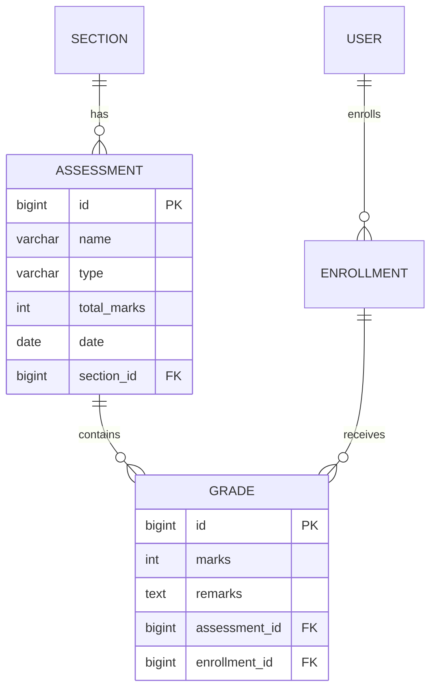

# v0.6 — Assessments & Grades

**Status:** Complete
**Date:** 2026-08-31

## Objective

Introduce academic assessment and grading: teachers can create assessments for sections and record student grades; students can view their own results.

## Features Implemented

- `Assessment` model:
  - Foreign key to `Section`
  - `name`, `type` (Exam, Quiz, Assignment, Project), `total_marks` (positive integer), `date`
- `Grade` model:
  - Foreign key to `Assessment`
  - Foreign key to `Enrollment` (ensures student belongs to section)
  - `marks` (integer), `remarks`
  - Unique constraint on `(assessment, enrollment)`
  - Database CHECK constraint: `marks >= 0`
  - Model validation (`clean()`) ensures `marks <= assessment.total_marks`
- Admin registration for both models
- DRF endpoints:
  - `/api/assessments/` – list/create (admin/teacher)
    - Teachers can only create assessments for their own sections
    - Teachers see only assessments for sections they teach
  - `/api/grades/` – list/create (admin/teacher)
    - Supports bulk creation (send JSON array)
    - Atomic transaction for bulk create
    - Validates enrollment belongs to assessment's section
    - Validates marks range (0 to total_marks)
  - `/api/grade-summary/` – any authenticated user
    - Students see own summary (per section: assessments count, total obtained, total possible, percentage)
    - Admin/teacher must provide `student_id` query param
- Permissions:
  - `IsAdminOrTeacher` for assessment and grade creation
  - `IsAuthenticated` for summary with role-based filtering
- Tests: 78 total, covering models, API, permissions, bulk creation, duplicate prevention, and summary calculations.

## Entity Relationship Diagram (ERD)



## Key Learning Points

- Using `CheckConstraint` in Django Meta to enforce `marks >= 0` at database level
- Cross-field validation in serializer (`validate` method) for marks <= total_marks and section consistency
- Model `clean()` method for validation, automatically called by Django admin `full_clean()`
- Difference between database constraints (hard enforcement) and application-level validation (softer, can be bypassed by direct DB access)
- Bulk creation in DRF: detecting list input, using `many=True`, and atomic transaction to ensure all-or-nothing
- Permission patterns: teachers restricted to their sections; students restricted to own data
- Aggregation for grade summary: sum of obtained marks, sum of possible marks, percentage calculation
- Query filtering based on user role in `get_queryset`

## How to Run

```bash
source venv/bin/activate
python manage.py runserver
```

- Admin panel: create assessments and grades
- API endpoints: `/api/assessments/`, `/api/grades/`, `/api/grade-summary/`

## Testing

```bash
python manage.py test
```

All 78 tests pass.

## Next Steps

Proceed to **v0.7 — UI & HTMX Refinement**: enhance the user interface with partial page updates and improved interactivity using HTMX, while keeping Django templates as the foundation.