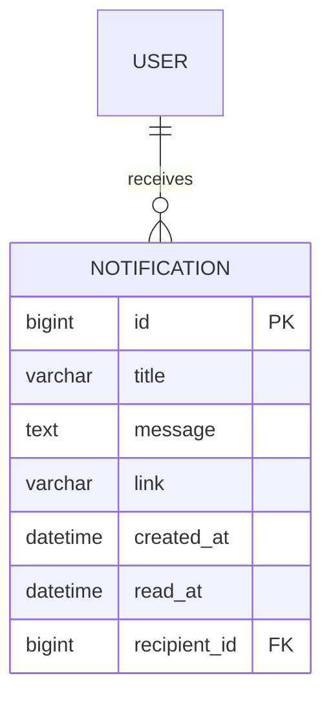

# v0.8 — Notifications

**Status:** Complete
**Date:** 2026-09-01

## Objective

Introduce simple in-app notifications for user-specific events. Notifications are created synchronously when key academic actions occur (enrollment, grade posting) and users can view, mark read, and manage them.

## Features Implemented

- **Notification model** (`notifications.Notification`):
  - `recipient` (FK to User)
  - `title`, `message`
  - `link` (optional URL)
  - `created_at`, `read_at`
- **Notification service** (`notifications/services.py`):
  - `notify_user(recipient, title, message, link=None)` – creates a notification
- **Signals for automatic creation**:
  - `post_save` on `Enrollment` – notifies student of successful enrollment
  - `post_save` on `Grade` – notifies student of grade posted
  - Signals are connected in `academics/apps.py` `ready()`
- **Notification views**:
  - `notification_list` – list user's notifications with filter (all, unread, read), paginated
  - `notification_detail` – mark as read and redirect to link (if any)
  - `mark_all_read` – mark all as read
  - `unread_count` – HTMX endpoint returning badge HTML
- **HTMX integration**:
  - Navbar bell icon with unread count badge, polled every 30 seconds
  - Mark read via POST
  - Filter buttons (all/unread/read) using HTMX partial update
  - Pagination for notification list
- **Context processor**:
  - `notifications.context_processors.unread_notifications_count` provides `unread_count` globally
- **Admin registration** for Notification model
- **Tests**: 80 total, covering notification model, API triggers, and notification views.

## Entity Relationship Diagram (ERD)



## Key Learning Points

- Separating notifications into a dedicated Django app for modularity
- Using Django signals (`post_save`) to trigger actions automatically on model creation
- Connecting signals in `AppConfig.ready()`
- Creating a context processor to inject data into all templates
- HTMX patterns: polling with `hx-trigger="every 30s"`, swapping partial HTML, avoiding infinite loops by removing `load` trigger
- Using `render_to_string` for HTMX partial responses
- `mark_as_read` logic using `read_at` timestamp
- Filtering and pagination for user-specific data
- Ensuring notifications work regardless of creation method (admin, API, shell) by using signals instead of view-level code

## How to Run

```bash
source venv/bin/activate
python manage.py runserver
```

- View notifications at `/notifications/`
- Unread count badge in navbar updates every 30 seconds
- Create enrollment or grade via admin/API; student gets notification automatically

## Testing

```bash
python manage.py test
```

All 80 tests pass.

## Next Steps

Proceed to **v0.9 — Redis & Celery**: introduce asynchronous processing for background tasks, with Redis as message broker and Celery workers.